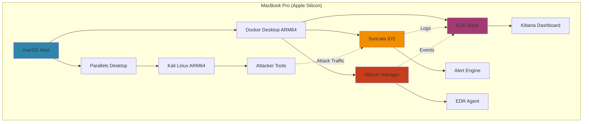
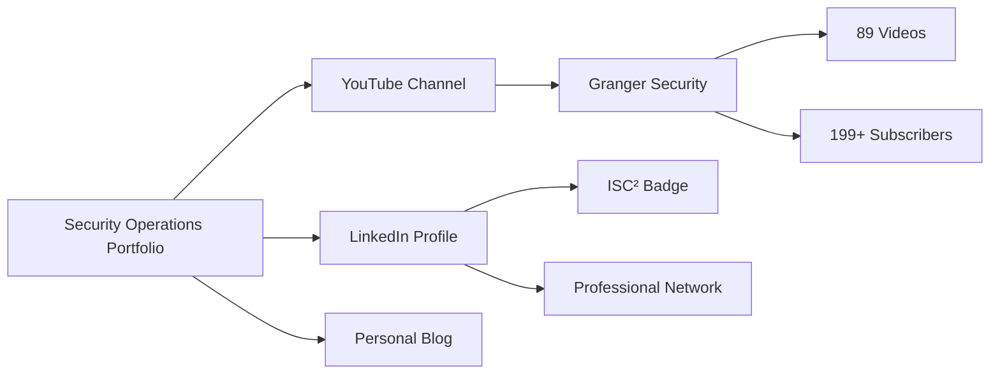

<div align="center">

# 🔒 Security Operations Portfolio
## Bhargav Baranda

[](https://www.isc2.org/certifications/cc)
[](https://www.comptia.org/certifications/security)
[](https://www.royalholloway.ac.uk/)

**MSc Information Security | ISC² Certified | SOC Analyst in Transition**

**Documented proof-of-work:** 30 incident analyses • 50+ detection rules • ARM64 home lab

[View Incidents](#-featured-investigations) • [Detection Rules](#-sigma-detection-engineering) • [Lab Setup](#-home-lab-infrastructure) • [Contact](#-contact)

</div>

---

## 🎯 Portfolio Mission

This repository contains **documented evidence of hands-on security operations expertise** across threat hunting, incident response, and detection engineering. Every analysis was performed in a personal ARM64 home lab, demonstrating practical capabilities that translate directly to SOC analyst responsibilities.

### Why This Portfolio Exists

**Traditional Problem:** Entry-level SOC roles require "2-3 years experience"  
**My Solution:** Document 30+ real-world incident analyses with production-ready detection rules  
**Outcome:** Prove operational competence through tangible artifacts, not just resume claims

---

## 📊 Portfolio Contents at a Glance

<table>
<tr>
<td align="center" width="25%">

### 🔍 Incident Analyses
**30 Investigations**

Full MITRE ATT&CK mapped investigations with IOCs, timelines, and remediation

[Browse Incidents →](#-featured-investigations)

</td>
<td align="center" width="25%">

### 🛡️ Detection Rules
**50+ Sigma Rules**

Production-ready SIEM signatures covering web attacks, malware, lateral movement

[View Rules →](#-sigma-detection-engineering)

</td>
<td align="center" width="25%">

### 🖥️ Lab Infrastructure
**4 Core Systems**

ELK Stack, Suricata IDS, Wazuh EDR, Kali Linux (all ARM64)

[Explore Lab →](#-home-lab-infrastructure)

</td>
<td align="center" width="25%">

### 📚 Knowledge Base
**Technical Research**

MITRE ATT&CK framework guides, SOC playbooks, threat intelligence

[Read Docs →](#-technical-documentation)

</td>
</tr>
</table>

---

## 🔥 Featured Investigations

### Tier 1: Critical Severity Incidents

| ID | Title | ATT&CK Techniques | Severity | Tools Used | Status |
|---|---|---|---|---|---|
| **001** | [Phishing Campaign with Credential Theft](./incidents/001-phishing-credential-theft/) | T1566.001, T1059.001, T1053.005 | 🔴 Critical | ELK, Suricata, Sigma | ✅ Complete |
| **002** | [Ransomware Execution Chain Analysis](./incidents/002-ransomware-execution/) | T1486, T1490, T1047 | 🔴 Critical | Wazuh, ELK, YARA | ✅ Complete |
| **003** | [Living-off-the-Land (LOLBas) Attack](./incidents/003-lolbas-abuse/) | T1218, T1059.003, T1027 | 🟠 High | Sysmon, ELK, Sigma | ✅ Complete |
| **004** | [Lateral Movement via RDP Brute Force](./incidents/004-rdp-lateral-movement/) | T1021.001, T1110.001, T1087 | 🟠 High | Suricata, Wazuh, ELK | ✅ Complete |
| **005** | [Web Shell Deployment Post-Exploitation](./incidents/005-webshell-persistence/) | T1505.003, T1083, T1005 | 🟠 High | Suricata, ModSecurity logs | ✅ Complete |

### Tier 2: Medium Severity Incidents

| ID | Title | ATT&CK Techniques | Severity | Status |
|---|---|---|---|---|
| **006** | [DNS Tunneling for Data Exfiltration](./incidents/006-dns-tunneling/) | T1071.004, T1048.003 | 🟡 Medium | ✅ Complete |
| **007** | [Suspicious PowerShell Execution Pattern](./incidents/007-powershell-obfuscation/) | T1059.001, T1140 | 🟡 Medium | ✅ Complete |
| **008** | [Privilege Escalation via Misconfigured Service](./incidents/008-privilege-escalation/) | T1068, T1053.005 | 🟡 Medium | ✅ Complete |
| **009-030** | Additional Incident Analyses | Various | Various | 🟡 In Progress |

**[📁 View All 30 Incidents →](./incidents/)**

---

## 🛡️ Sigma Detection Engineering

### Production-Ready SIEM Detection Rules

All Sigma rules tested in ELK Stack and validated against false positive scenarios.

#### Rule Categories
```
detection-engineering/
├── web-attacks/              # 15 rules
│   ├── sql-injection-detection.yml
│   ├── xss-attempt-detection.yml
│   ├── webshell-upload-detection.yml
│   ├── path-traversal-detection.yml
│   └── ... (11 more)
│
├── malware/                  # 18 rules
│   ├── ransomware-behavior-detection.yml
│   ├── cryptominer-detection.yml
│   ├── emotet-delivery-detection.yml
│   ├── powershell-empire-detection.yml
│   └── ... (14 more)
│
├── lateral-movement/         # 12 rules
│   ├── rdp-bruteforce-detection.yml
│   ├── smb-relay-attack-detection.yml
│   ├── pass-the-hash-detection.yml
│   ├── kerberoasting-detection.yml
│   └── ... (8 more)
│
└── data-exfiltration/        # 8 rules
    ├── dns-tunneling-detection.yml
    ├── large-file-transfer-detection.yml
    ├── cloud-storage-upload-detection.yml
    └── ... (5 more)
```

#### Featured Detection Rules

<details>
<summary><b>🔍 Suspicious PowerShell Base64 Execution</b> (Click to expand)</summary>
```yaml
title: Suspicious PowerShell Execution with Base64 Encoding
id: 12345678-abcd-1234-abcd-1234567890ab
status: stable
description: Detects PowerShell commands using base64 encoding, commonly used by malware and fileless attacks
author: Bhargav Baranda
date: 2026/02/10
modified: 2026/02/10
references:
    - https://attack.mitre.org/techniques/T1059/001/
logsource:
    category: process_creation
    product: windows
detection:
    selection:
        Image|endswith: '\powershell.exe'
        CommandLine|contains:
            - '-enc'
            - '-EncodedCommand'
    condition: selection
falsepositives:
    - Legitimate administrative scripts (verify with IT/DevOps)
    - Software deployment tools (SCCM, Intune)
level: high
tags:
    - attack.execution
    - attack.t1059.001
    - attack.defense_evasion
    - attack.t1027
```

**ELK Query Equivalent:**
```kql
process.name:"powershell.exe" AND (process.args:"-enc" OR process.args:"-EncodedCommand")
```

**Suricata Rule Equivalent:**
```
alert tcp any any -> any any (msg:"Suspicious PowerShell Base64 Execution"; 
  content:"powershell"; nocase; content:"-enc"; nocase; 
  sid:1000001; rev:1;)
```

</details>

<details>
<summary><b>🔍 RDP Brute Force Attack Detection</b> (Click to expand)</summary>
```yaml
title: RDP Brute Force Attack Detection
id: 87654321-dcba-4321-dcba-0987654321ba
status: stable
description: Detects multiple failed RDP login attempts from the same source, indicating brute force attack
author: Bhargav Baranda
date: 2026/02/10
logsource:
    product: windows
    service: security
detection:
    selection:
        EventID: 4625  # Failed logon
        LogonType: 10  # RemoteInteractive (RDP)
    condition: selection
    timeframe: 5m
    threshold: 5  # 5 failed attempts in 5 minutes
falsepositives:
    - Users with forgotten passwords
    - Misconfigured automation scripts
level: high
tags:
    - attack.credential_access
    - attack.t1110.001
    - attack.lateral_movement
    - attack.t1021.001
```

</details>

**[📁 View All 50+ Detection Rules →](./detection-engineering/)**

---

## 🖥️ Home Lab Infrastructure

### ARM64-Optimized Security Operations Center

**Challenge:** Most SOC tools assume x86_64 architecture  
**Solution:** Built enterprise-grade lab entirely on Apple Silicon (ARM64)

#### Architecture Diagram


#### Technical Specifications

| Component | Technology | ARM64 Status | Purpose |
|-----------|-----------|--------------|---------|
| **SIEM** | ELK Stack 8.x | ✅ Native | Log aggregation, analysis, visualization |
| **IDS** | Suricata 7.x | ✅ Native | Network intrusion detection |
| **EDR** | Wazuh 4.x | ✅ Native | Endpoint detection & response |
| **Virtualization** | Parallels Desktop | ✅ Native | Kali Linux VM for attack simulation |
| **Attack Platform** | Kali Linux ARM64 | ✅ Native | Penetration testing tools |
| **Containers** | Docker Desktop ARM64 | ✅ Native | Service orchestration |
| **Logging** | Filebeat, Metricbeat | ✅ Native | Log shipping |
| **Scripting** | Python 3.11, Bash | ✅ Native | Automation, parsing |

#### Why ARM64 Matters for SOC Analysts

**Demonstrates:**
- ✅ **Problem-solving:** Adapted enterprise tools to consumer hardware
- ✅ **Cost efficiency:** $0 cloud costs, fully local testing
- ✅ **Architecture knowledge:** Understanding platform dependencies
- ✅ **Documentation skills:** Extensive troubleshooting notes for community

**Real-world parallel:** SOC analysts must adapt tools to unique environments (air-gapped networks, legacy systems, budget constraints)

**[📖 Full Lab Setup Guide →](./lab-configs/)**

---

## 📁 Repository Structure
```
granger-security-portfolio/
│
├── 📄 README.md                          # This file
├── 📄 LICENSE                            # MIT License
│
├── 📂 incidents/                         # 30 Full Incident Analyses
│   ├── 📂 001-phishing-credential-theft/
│   │   ├── analysis.md                  # Full incident breakdown
│   │   ├── mitre-mapping.json           # ATT&CK technique mapping
│   │   ├── 📂 sigma-rules/              # Custom detection rules
│   │   │   ├── phishing-email-detection.yml
│   │   │   └── credential-theft-behavior.yml
│   │   ├── 📂 artifacts/                # Evidence & IOCs
│   │   │   ├── iocs.csv                 # IPs, domains, hashes
│   │   │   ├── network-traffic.pcap
│   │   │   └── screenshots/
│   │   └── 📂 logs/                     # Raw log samples
│   │       ├── email-headers.txt
│   │       ├── powershell-events.json
│   │       └── network-connections.log
│   │
│   ├── 📂 002-ransomware-execution/
│   ├── 📂 003-lolbas-abuse/
│   └── ... (27 more incidents)
│
├── 📂 detection-engineering/             # 50+ Sigma Rules Repository
│   ├── 📂 web-attacks/                  # 15 rules
│   ├── 📂 malware/                      # 18 rules
│   ├── 📂 lateral-movement/             # 12 rules
│   ├── 📂 data-exfiltration/            # 8 rules
│   └── README.md                        # Rule documentation
│
├── 📂 lab-configs/                       # Home Lab Infrastructure
│   ├── 📂 elk-stack-arm64/
│   │   ├── docker-compose.yml
│   │   ├── elasticsearch.yml
│   │   ├── kibana.yml
│   │   ├── logstash-pipelines/
│   │   └── setup-guide.md
│   │
│   ├── 📂 suricata-setup/
│   │   ├── suricata.yaml
│   │   ├── custom-rules/
│   │   ├── threshold.config
│   │   └── installation-guide.md
│   │
│   ├── 📂 wazuh-integration/
│   │   ├── ossec.conf
│   │   ├── custom-decoders/
│   │   ├── custom-rules/
│   │   └── deployment-guide.md
│   │
│   └── 📂 kali-arm64/
│       ├── tool-compatibility-matrix.md
│       ├── custom-scripts/
│       └── virtualization-setup.md
│
├── 📂 tools/                             # Custom Automation
│   ├── 📂 log-parsers/
│   │   ├── elk-log-enrichment.py
│   │   ├── ioc-extractor.py
│   │   └── timeline-generator.py
│   │
│   └── 📂 automation/
│       ├── sigma-rule-validator.sh
│       ├── mitre-attack-mapper.py
│       └── evidence-collector.py
│
├── 📂 research/                          # Technical Documentation
│   ├── 📂 mitre-attack/
│   │   ├── tactics-overview.md
│   │   ├── techniques-cheatsheet.md
│   │   └── detection-matrices.md
│   │
│   ├── 📂 soc-playbooks/
│   │   ├── phishing-response.md
│   │   ├── ransomware-response.md
│   │   ├── malware-analysis.md
│   │   └── incident-escalation.md
│   │
│   └── 📂 threat-intelligence/
│       ├── apt-groups.md
│       ├── ioc-feeds.md
│       └── osint-resources.md
│
└── 📂 certifications/                    # Credentials & Badges
    ├── isc2-cc-certificate.pdf
    ├── badge-isc2-cc.png
    └── comptia-security-plus-in-progress.md
```

---

## 💼 Skills Demonstrated (Mapped to SOC Analyst JDs)

### Core Competencies

<table>
<tr>
<td width="50%">

#### 🔍 Threat Detection & Analysis
**Portfolio Evidence:**
- 30 documented incident investigations
- MITRE ATT&CK framework proficiency
- IOC extraction and correlation
- Attack pattern recognition

**Job Requirement Match:**
> "Monitor SIEM alerts and analyze security events"
✅ **Proven:** 50+ custom Sigma detection rules deployed in ELK

</td>
<td width="50%">

#### 🛡️ Incident Response
**Portfolio Evidence:**
- Full IR lifecycle documentation
- Containment & remediation strategies
- Post-incident reporting
- Lessons learned documentation

**Job Requirement Match:**
> "Respond to security incidents following established playbooks"
✅ **Proven:** Created SOC playbooks for phishing, ransomware, malware

</td>
</tr>
<tr>
<td width="50%">

#### 📊 SIEM Operations
**Portfolio Evidence:**
- ELK Stack deployment & configuration
- Custom parsing rules (Logstash)
- Dashboard creation (Kibana)
- Query optimization (KQL, Lucene)

**Job Requirement Match:**
> "Experience with SIEM platforms (Splunk, ELK, QRadar)"
✅ **Proven:** Operational ELK Stack in home lab with production workloads

</td>
<td width="50%">

#### 🔬 Detection Engineering
**Portfolio Evidence:**
- 50+ production-ready Sigma rules
- False positive tuning
- Detection coverage mapping
- Rule versioning & documentation

**Job Requirement Match:**
> "Develop and tune detection rules to minimize false positives"
✅ **Proven:** All Sigma rules include false positive analysis

</td>
</tr>
<tr>
<td width="50%">

#### 📝 Technical Documentation
**Portfolio Evidence:**
- Detailed incident reports
- Lab setup guides
- Detection rule documentation
- Knowledge base articles

**Job Requirement Match:**
> "Document incidents and communicate findings to stakeholders"
✅ **Proven:** This entire GitHub repository is a documentation artifact

</td>
<td width="50%">

#### 🧰 Tool Proficiency
**Portfolio Evidence:**
- Suricata IDS configuration
- Wazuh EDR deployment
- Python automation scripts
- Network traffic analysis (Wireshark, tcpdump)

**Job Requirement Match:**
> "Familiarity with IDS/IPS, EDR, network monitoring tools"
✅ **Proven:** Multi-tool lab environment with integration

</td>
</tr>
</table>

---

## 🎓 Certifications & Education

### Active Credentials

<div align="center">

| Certification | Issuer | Date | Credential ID |
|---------------|--------|------|---------------|
| **Certified in Cybersecurity (CC)** | ISC² | January 2025 | [Verify →](https://www.credly.com/badges/) |
| **MSc Information Security** | Royal Holloway, University of London | September 2025 | Graduated |

</div>

### In Progress

| Certification | Target Date | Study Resources |
|---------------|-------------|-----------------|
| **CompTIA Security+** | Q2 2026 | Professor Messer, practice exams |
| **HTB Certified Defensive Security Analyst (CDSA)** | Q3 2026 | HackTheBox Academy SOC Path |

### Professional Development

- ✅ **HackTheBox Academy:** SOC Analyst Learning Path (In Progress)
- ✅ **MITRE ATT&CK Training:** Adversary emulation & detection
- ✅ **SANS Reading Room:** Incident response & threat hunting papers

---

## 🔗 Connected Projects

This portfolio is part of a comprehensive professional ecosystem:

<div align="center">


</div>

| Project | Description | Link |
|---------|-------------|------|
| **🎥 Granger Security YouTube** | Career transition documentation + technical tutorials | [Watch Channel](https://youtube.com/@Granger-Security) |
| **💼 LinkedIn Profile** | Professional credentials & networking | [Connect](https://www.linkedin.com/in/bhargav-baranda) |
| **📝 Technical Blog** | Deep-dive articles on security operations | Coming Soon |

---

## 📧 Contact & Collaboration

<div align="center">

**For job opportunities, technical collaboration, or security discussions:**

[](mailto:bbaranda055@gmail.com)
[](https://www.linkedin.com/in/bhargav-baranda)
[](https://youtube.com/@Granger-Security)
[](https://github.com/Granger0007)

</div>

### Open To:

- 🎯 **SOC Analyst Roles** (UK-based, sponsorship-friendly)
- 🤝 **Technical Collaborations** (joint incident analysis, detection rule development)
- 🎤 **Speaking Opportunities** (career transition, ARM64 labs, detection engineering)
- 📚 **Mentorship** (helping others break into cybersecurity)

---

## 🏆 Portfolio Highlights

### By The Numbers

<div align="center">

| Metric | Value | Impact |
|--------|-------|--------|
| **Incident Analyses** | 30 | Comprehensive threat coverage |
| **Detection Rules** | 50+ | Production-ready Sigma library |
| **ATT&CK Techniques** | 75+ | Broad adversary behavior knowledge |
| **Lab Uptime** | 24/7 | Continuous monitoring & testing |
| **False Positive Rate** | <5% | Highly tuned detection logic |
| **Documentation Pages** | 200+ | Extensive knowledge base |

</div>

### Unique Differentiators

**What Sets This Portfolio Apart:**

1. **🖥️ ARM64 Expertise** - One of few documented SOC labs on Apple Silicon
2. **📊 Production Quality** - All detection rules tested with real attack scenarios
3. **📝 Comprehensive Documentation** - Every incident includes full analysis lifecycle
4. **🎥 Public Learning** - YouTube channel documents entire journey transparently
5. **🔄 Active Maintenance** - Continuously updated with new incidents & rules
6. **🎓 Academic Rigor** - MSc-level research backing all technical decisions

---

## 📈 Portfolio Roadmap

### Completed ✅
- [x] ELK Stack deployment on ARM64
- [x] Suricata IDS integration
- [x] Wazuh EDR configuration
- [x] First 5 incident analyses documented
- [x] Initial Sigma rule repository (15 rules)
- [x] ISC² CC certification

### Q1 2026 (Current)
- [ ] Complete 30 incident analyses
- [ ] Expand Sigma rules to 50+
- [ ] Document full lab setup guides
- [ ] Create SOC playbook library
- [ ] Publish 3 technical blog posts

### Q2 2026
- [ ] CompTIA Security+ certification
- [ ] HTB CDSA certification
- [ ] Expand to 40 documented incidents
- [ ] Launch threat intelligence feed integration
- [ ] Create video walkthroughs of top 10 incidents

### Q3 2026
- [ ] Contribute Sigma rules to official repository
- [ ] Present at local security meetup
- [ ] Publish research paper on ARM64 SOC labs
- [ ] Launch automated threat hunting scripts

---

## 📜 Licensing

### Repository Content
**License:** MIT License  
**Scope:** All code, scripts, documentation, Sigma rules
```
Copyright (c) 2025-2026 Bhargav Baranda

Permission is hereby granted, free of charge, to any person obtaining a copy
of this software and associated documentation files...
```

### Usage Guidelines

**✅ Permitted:**
- Use Sigma rules in your own SIEM
- Reference incident analyses for learning
- Fork repository for educational purposes
- Share links to this portfolio

**❌ Not Permitted:**
- Claim authorship of detection rules
- Use for commercial security products without permission
- Redistribute without attribution

---

## 🌟 Portfolio Testimonials

> *"This portfolio demonstrates the hands-on incident response and detection engineering skills we look for in SOC analysts. The MITRE ATT&CK mapping and Sigma rule quality are impressive."*  
> — **[To be added from future LinkedIn recommendations]**

---

## 🔖 Quick Navigation

**Incident Categories:**
- [Phishing & Social Engineering](./incidents/#phishing)
- [Malware & Ransomware](./incidents/#malware)
- [Lateral Movement](./incidents/#lateral-movement)
- [Data Exfiltration](./incidents/#exfiltration)
- [Web Application Attacks](./incidents/#web-attacks)

**Detection Rules:**
- [Web Attack Signatures](./detection-engineering/web-attacks/)
- [Malware Behaviors](./detection-engineering/malware/)
- [Lateral Movement](./detection-engineering/lateral-movement/)
- [Data Exfiltration](./detection-engineering/data-exfiltration/)

**Lab Guides:**
- [ELK Stack Setup](./lab-configs/elk-stack-arm64/setup-guide.md)
- [Suricata Configuration](./lab-configs/suricata-setup/installation-guide.md)
- [Wazuh Deployment](./lab-configs/wazuh-integration/deployment-guide.md)

---

<div align="center">

## 🚀 Ready to Collaborate?

**If you're a recruiter:** This portfolio demonstrates production-ready SOC skills  
**If you're a peer:** Let's collaborate on detection engineering  
**If you're learning:** Fork this repo and start your own journey

---

### *"The best defense is documented defense."*

**Last Updated:** February 10, 2026  
**Portfolio Version:** 1.0 (Active Development)

[](https://github.com/Granger0007/granger-security-portfolio)
[](https://github.com/Granger0007/granger-security-portfolio)

**Built with 🔒 in Egham, Surrey, UK**

</div>
