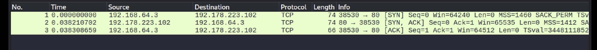

# Lab 002: TCP Three-Way Handshake Analysis with Wireshark

## Lab Overview

| Field | Details |
|-------|---------|
| **Lab ID** | 002 |
| **Date Completed** | February 2026 |
| **Lab Type** | Network Traffic Analysis |
| **Tool Used** | Wireshark |
| **Environment** | Kali Linux (ARM64) via Parallels VM |
| **Objective** | Capture and analyze complete TCP connection lifecycle |

---

## Executive Summary

Using Wireshark on Kali Linux, I captured and analyzed live network traffic from a simple HTTP request to Google. The exercise revealed the complete TCP connection lifecycle across 10 packets, demonstrating the three-way handshake, data transfer, and connection termination. Two security concerns were identified: unencrypted HTTP initiation creating SSL stripping vulnerability, and unknown destination IP requiring threat intelligence verification.

**Key Findings:**
- TCP three-way handshake captured in real-time (SYN → SYN-ACK → ACK)
- HTTP GET request transmitted unencrypted before 301 HTTPS redirect
- Ephemeral port behavior observed (source port 38530)
- Clean connection termination sequence documented (FIN-ACK pattern)

---

## Lab Setup

**Hardware:** MacBook Pro (Apple Silicon)  
**Virtualization:** Parallels Desktop  
**Operating System:** Kali Linux (ARM64)  
**Network Interface:** eth0 (IP: 192.168.64.3)  
**Capture Tool:** Wireshark  
**Target:** http://google.com (IP: 192.178.223.102)

**Command Executed:**
```bash
curl http://google.com
```

**Wireshark Filter Applied:**
```
tcp.stream eq 0
```

---

## The Ten Packets - Complete Connection Lifecycle

### Captured Traffic Overview


*Complete 10-packet capture showing TCP handshake, HTTP exchange, and connection termination*

### TCP Three-Way Handshake (Packets 1-3)


*Detailed view of SYN → SYN-ACK → ACK sequence establishing connection*

---

## Packet-by-Packet Analysis

### **Packet 1: SYN (Connection Request)**

**Direction:** Client → Server  
**Source:** 192.168.64.3:38530 (Kali VM)  
**Destination:** 192.178.223.102:80 (Google)  
**Flags:** SYN  

**What Happened:**
My Kali machine initiated contact with Google's web server. The SYN (Synchronize) flag signals "I want to establish a connection - are you ready?"

**Key Observations:**
- **Port 80** = Standard HTTP port (well-known service port)
- **Port 38530** = Ephemeral port (randomly assigned by OS for this connection)
- This pattern (internal host → external IP on ephemeral port) is identical to C2 beacon behavior

**Security Relevance:**
SOC analysts monitoring for Command & Control (C2) traffic look for repeated connections from internal hosts using different ephemeral ports to the same external destination. The ephemeral port changes; the destination stays constant.

---

### **Packet 2: SYN-ACK (Connection Acceptance)**

**Direction:** Server → Client  
**Source:** 192.178.223.102:80 (Google)  
**Destination:** 192.168.64.3:38530 (Kali VM)  
**Flags:** SYN, ACK  

**What Happened:**
Google acknowledged receiving my SYN and simultaneously sent its own SYN to synchronize the connection from its side.

**Translation:** "Yes, I'm here. I heard you. I'm ready to talk."

**TCP Reliability:**
The ACK flag confirms receipt of Packet 1. The SYN flag establishes Google's side of the connection. Both happen in a single packet.

---

### **Packet 3: ACK (Handshake Complete)**

**Direction:** Client → Server  
**Source:** 192.168.64.3:38530  
**Destination:** 192.178.223.102:80  
**Flags:** ACK  

**What Happened:**
My machine confirmed receiving Google's SYN-ACK. The three-way handshake is now complete, and data transfer can begin.

**Duration:** Less than 40 milliseconds (0.038 seconds from Packet 1 to Packet 3)

**This is the TCP three-way handshake:**
1. Client sends SYN
2. Server sends SYN-ACK
3. Client sends ACK
4. **Connection established**

---

### **Packet 4: HTTP GET Request**

**Direction:** Client → Server  
**Protocol:** HTTP  
**Content:** `GET / HTTP/1.1`  

**What Happened:**
Now that the TCP connection exists, my machine sent the actual HTTP request: "Give me your homepage."

**Security Concern #1 - Unencrypted Transmission:**
This GET request traveled across the network **completely unencrypted**. Anyone with access to the network path could read:
- Destination URL
- HTTP headers
- Any cookies or tokens in the request

**Why This Matters:**
Even though Google will redirect to HTTPS, the redirect arrives **after** the unencrypted request has already been sent. This window creates an SSL stripping vulnerability.

---

### **Packet 5: ACK (Request Acknowledged)**

**Direction:** Server → Client  
**Flags:** ACK  

**What Happened:**
Google confirmed receiving the GET request. No data yet - just acknowledgment of receipt.

**TCP Reliability Mechanism:**
Every significant data transmission receives an ACK. If no ACK arrives within the timeout window, TCP automatically retransmits.

---

### **Packet 6: HTTP 301 Redirect**

**Direction:** Server → Client  
**Protocol:** HTTP  
**Status Code:** 301 Moved Permanently  
**Location:** `http://www.google.com/` (redirects to HTTPS version)  

**What Happened:**
Google refused to serve content over unencrypted HTTP and sent a redirect to the HTTPS version instead.

**Critical Insight:**
The redirect does **not** prevent the security issue in Packet 4. The unencrypted GET request was already transmitted before this redirect arrived. The vulnerability window is small but real.

**Attack Scenario - SSL Stripping:**
An attacker performing ARP poisoning on the local network could:
1. Intercept Packet 4 (unencrypted GET request)
2. Prevent Packet 6 (301 redirect) from reaching the client
3. Keep the victim on HTTP permanently
4. Read all subsequent traffic in cleartext

---

### **Packet 7: ACK (Redirect Acknowledged)**

**Direction:** Client → Server  
**Flags:** ACK  

**What Happened:**
My machine acknowledged receiving the 301 redirect.

---

### **Packets 8-10: Connection Termination (FIN-ACK Sequence)**

**Packet 8:** Client → Server [FIN, ACK] - "I'm done sending data"  
**Packet 9:** Server → Client [FIN, ACK] - "I'm done too"  
**Packet 10:** Client → Server [ACK] - "Understood. Goodbye."

**What Happened:**
Both sides mutually agreed to close the connection cleanly using the FIN (Finished) flag.

**Security Indicator - Clean vs Abrupt Termination:**

**Legitimate traffic:** Clean FIN-ACK sequence (like this)  
**Suspicious traffic:** Abrupt RST (Reset) packets indicating forced termination

**Why This Matters:**
- Malware being killed by endpoint protection → RST
- Unstable C2 connection → RST floods
- Attacker cutting connection during detection → RST

SOC analysts monitoring for RST anomalies are watching for exactly this pattern.

---

## Complete Traffic Flow Visualization
```
KALI LINUX (192.168.64.3)          GOOGLE (192.178.223.102)
         |                                    |
         |----------[SYN]-------------------->|  "Can we connect?"
         |<---------[SYN, ACK]----------------|  "Yes, ready."
         |----------[ACK]-------------------->|  "Connected."
         |                                    |
         |  ← TCP HANDSHAKE COMPLETE (0.038s) →  |
         |                                    |
         |----------[GET /]------------------>|  "Give me your homepage."
         |<---------[ACK]---------------------|  "Request received."
         |<---------[301 Redirect]------------|  "Use HTTPS instead."
         |----------[ACK]-------------------->|  "Redirect received."
         |                                    |
         |  ← HTTP EXCHANGE COMPLETE (0.075s) →  |
         |                                    |
         |----------[FIN, ACK]--------------->|  "I'm done."
         |<---------[FIN, ACK]----------------|  "Me too."
         |----------[ACK]-------------------->|  "Goodbye."
         |                                    |
         |  ← CONNECTION CLOSED (0.113s)      →  |
```

---

## OSI Layer Analysis - Reading One Packet Across All Layers

**Packet 1 (SYN) Breakdown:**

| OSI Layer | Layer Name | Evidence in Packet |
|-----------|------------|-------------------|
| **Layer 1** | Physical | Captured on interface `eth0` - electrical signals on network card |
| **Layer 2** | Data Link | Source MAC: `ee:7b:19:5a:69:12` (Kali VM's network interface) |
| **Layer 3** | Network | Source IP: `192.168.64.3` (How Google knew where to send SYN-ACK) |
| **Layer 4** | Transport | TCP - Source port 38530, Destination port 80, SYN flag set |
| **Layer 5** | Session | Session establishment begins with SYN |
| **Layer 6** | Presentation | No encoding/encryption (plaintext HTTP) |
| **Layer 7** | Application | HTTP protocol (though GET request comes in Packet 4) |

**Socket Pair (Unique Connection Identifier):**
- Source IP: 192.168.64.3
- Source Port: 38530
- Destination IP: 192.178.223.102
- Destination Port: 80

These four values together uniquely identify this TCP connection. No two active connections share the same socket pair simultaneously.

---

## Security Findings

### Finding 1: Unencrypted HTTP Initiation (HIGH)

**Issue:**
Connection began with plaintext HTTP (Packet 4), transmitting the GET request unencrypted before Google's 301 HTTPS redirect arrived (Packet 6).

**Vulnerability Window:**
~37 milliseconds between unencrypted request transmission and redirect receipt.

**Attack Scenario - SSL Stripping:**
An attacker with network access (via ARP poisoning at Layer 2) could:
1. Intercept the HTTP GET request in transit
2. Block the 301 redirect from reaching the client
3. Maintain unencrypted HTTP session permanently
4. Read all subsequent traffic in cleartext

**MITRE ATT&CK Mapping:**
- **T1557** - Adversary-in-the-Middle
- **T1040** - Network Sniffing

**SOC Detection Opportunity:**
```
Alert on:
- HTTP traffic (port 80) from corporate workstations
- Policy violation: All web traffic should default to HTTPS
- Workstations initiating unencrypted connections = potential interception risk
```

**Remediation:**
- Enforce HSTS (HTTP Strict Transport Security) headers
- Configure browsers/applications to default to HTTPS
- Deploy network monitoring for HTTP protocol violations

---

### Finding 2: Unknown Destination IP Requiring Verification (MEDIUM)

**Issue:**
Workstation connected to external IP `192.178.223.102` on port 80.

**SOC Analyst Response:**
Unknown outbound connections require immediate threat intelligence verification:

**Threat Intelligence Lookup Process:**
1. **VirusTotal** - Check against 90+ security vendor databases
2. **AbuseIPDB** - Community-reported malicious IP database
3. **AlienVault OTX** - Known threat actor infrastructure mapping
4. **Shodan** - Service enumeration and ownership verification

**Result in This Case:**
- IP confirmed as Google infrastructure (clean)
- No malicious indicators found
- Legitimate traffic

**But the Process is Critical:**
The verification workflow is **identical** whether the destination is Google or a ransomware C2 server. You verify. You document. You never assume.

**MITRE ATT&CK Mapping:**
- **T1071.001** - Application Layer Protocol: Web Protocols (potential C2 channel)

**SOC Detection Opportunity:**
```
Alert on:
- First-time-seen destination IPs from internal hosts
- Outbound connections to IPs not in known-good whitelist
- Trigger: Automated threat intelligence enrichment pipeline
```

---

## Technical Skills Demonstrated

**Network Traffic Analysis:**
- Captured live traffic using Wireshark on Kali Linux
- Applied BPF filters to isolate TCP streams
- Analyzed packet headers across multiple OSI layers
- Interpreted TCP flags (SYN, ACK, FIN, RST)

**Protocol Understanding:**
- TCP three-way handshake (SYN → SYN-ACK → ACK)
- TCP connection termination (FIN-ACK sequence)
- HTTP protocol (GET requests, status codes)
- Ephemeral port behavior

**Security Analysis:**
- Identified SSL stripping vulnerability window
- Documented threat intelligence verification workflow
- Mapped findings to MITRE ATT&CK framework
- Proposed SOC detection rules

**Tools Proficiency:**
- Wireshark (packet capture and analysis)
- Kali Linux (security testing environment)
- BPF filtering syntax
- PCAP file analysis

---

## MITRE ATT&CK Framework Mapping

| Tactic | Technique ID | Technique Name | Relevance to Lab |
|--------|--------------|----------------|------------------|
| Credential Access | T1040 | Network Sniffing | What I did - capturing packets. What attackers do after compromising network infrastructure. |
| Command & Control | T1071.001 | Application Layer Protocol: Web Protocols | HTTP/HTTPS used for both legitimate traffic and C2 beaconing |
| Credential Access | T1557 | Adversary-in-the-Middle | SSL stripping attack scenario identified in Finding 1 |

---

## Security+ Knowledge Connection

**CompTIA Security+ SY0-701 Coverage:**

- **Objective 4.1** - Apply the appropriate tool to assess organizational security
  - **Tool:** Wireshark for network traffic analysis
  
- **Objective 2.2** - Explain common threat vectors and attack surfaces
  - **Threat Vectors:** SSL stripping, network sniffing, C2 beaconing patterns
  
- **Objective 1.1** - Compare and contrast security controls
  - **Controls:** Network monitoring, egress filtering, HSTS enforcement

---

## Lab Artifacts

**Files Generated:**
- Wireshark capture file (.pcap)
- Full packet capture screenshot (10 packets)
- TCP handshake isolated view (3 packets)
- Analysis documentation (this file)

**Evidence Preservation:**
All artifacts stored in GitHub repository for reference and verification.

---

## Lessons Learned

### What Worked Well

- Wireshark successfully captured all packets in real-time
- TCP handshake visible and analyzable at packet level
- Clean connection establishment and termination observed
- ARM64 architecture (Apple Silicon) compatible with Wireshark

### Key Insights

1. **Every connection leaves a trail** - 10 packets revealed IP addresses, ports, protocols, timing, and content
2. **Legitimate and malicious traffic use identical mechanisms** - The difference is destination, timing, and context
3. **Unencrypted HTTP is inherently vulnerable** - Even brief exposure creates risk
4. **Threat intelligence verification is non-negotiable** - Never assume an unknown IP is safe

### Skills Applied

- Network protocol analysis
- Packet-level traffic inspection
- Security vulnerability identification
- Threat modeling (SSL stripping attack scenario)
- MITRE ATT&CK framework application

---

## References

- Wireshark User Guide: https://www.wireshark.org/docs/
- TCP RFC 793: https://www.rfc-editor.org/rfc/rfc793
- MITRE ATT&CK Framework: https://attack.mitre.org/
- HTTP RFC 2616: https://www.rfc-editor.org/rfc/rfc2616

---

**Lab Completed:** February 27, 2026  
**Analyst:** Bhargav Baranda  
**Lab ID:** 002  
**Environment:** Kali Linux ARM64 • Wireshark • Parallels VM
